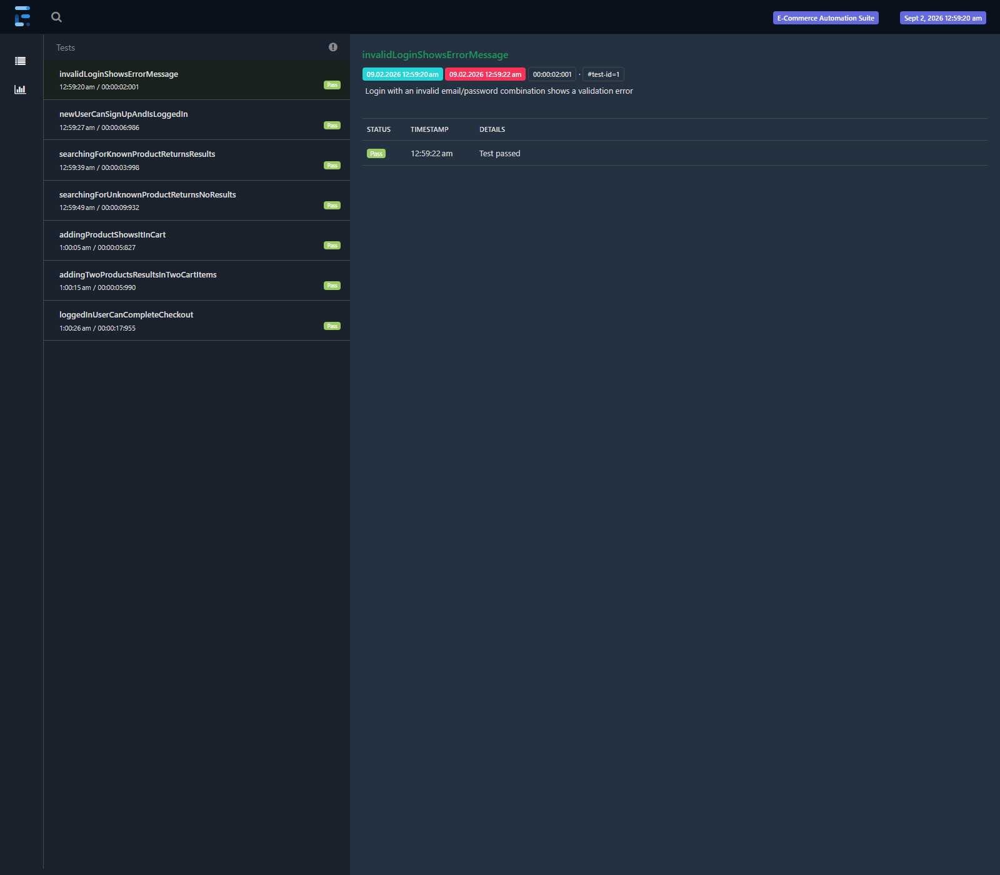

# Selenium Java Automation Framework

An end-to-end UI test automation framework built with **Selenium WebDriver**, **Java 21**, **TestNG**, and the **Page Object Model**, with **ExtentReports** dashboards and a **GitHub Actions** CI pipeline that runs the suite on every push.

The suite targets [automationexercise.com](https://automationexercise.com), a public site built for automation practice, and covers the core journey of an e-commerce user: account registration/login, product search, cart management, and full checkout through to order confirmation.

## Sample Report



*Generated by an actual local run of the suite — 7/7 tests passing, including full signup → login → cart → checkout → payment flows.*

## Tech Stack

| Layer | Tool |
|---|---|
| Language | Java 21 |
| Browser Automation | Selenium WebDriver 4.27 |
| Test Runner | TestNG 7.10 |
| Design Pattern | Page Object Model (POM) with PageFactory |
| Reporting | ExtentReports (Spark HTML reporter) |
| Build Tool | Maven |
| CI/CD | GitHub Actions |
| Driver Management | Selenium Manager (built into Selenium 4.6+, no separate WebDriverManager dependency needed) |

## Framework Architecture

```
selenium-java-framework/
├── src/main/java/com/anup/framework/
│   ├── base/
│   │   ├── DriverManager.java     # ThreadLocal WebDriver lifecycle (init/get/quit)
│   │   └── BaseTest.java          # @BeforeMethod/@AfterMethod setup & teardown
│   ├── pages/
│   │   ├── BasePage.java          # Shared explicit-wait helpers (click, type, getText...)
│   │   ├── HomePage.java
│   │   ├── LoginPage.java
│   │   ├── SignupPage.java
│   │   ├── ProductsPage.java
│   │   ├── CartPage.java
│   │   ├── CheckoutPage.java
│   │   └── PaymentPage.java
│   ├── model/
│   │   └── AccountDetails.java    # Test data record + random test-user factory
│   ├── utils/
│   │   ├── ConfigReader.java      # config.properties + -D system property overrides
│   │   ├── ExtentManager.java     # ExtentReports singleton
│   │   ├── ExtentTestManager.java # ThreadLocal<ExtentTest> for parallel-safe logging
│   │   └── ScreenshotUtil.java    # Failure screenshot capture
│   └── listeners/
│       └── TestListener.java      # TestNG ITestListener -> ExtentReports bridge
├── src/test/java/com/anup/framework/tests/
│   ├── LoginTest.java             # Signup + invalid-login validation
│   ├── SearchProductTest.java     # Known-keyword and no-match search
│   ├── AddToCartTest.java         # Single and multi-product cart flows
│   └── CheckoutTest.java          # Full signup -> cart -> checkout -> payment -> confirmation
├── src/test/resources/config.properties
├── testng.xml
├── .github/workflows/ci.yml
└── pom.xml
```

**Design decisions:**
- **Page Object Model with `PageFactory`** — each page exposes behavior (`login(...)`, `addProductToCartByIndex(...)`) rather than raw locators, so tests read like user journeys and a UI change only touches one page class.
- **`ThreadLocal<WebDriver>`** in `DriverManager` — the framework is parallel-execution-safe even though the current suite runs sequentially.
- **Config via `config.properties` + system property override** — `browser`, `headless`, and `base.url` can all be overridden per-run (e.g. `-Dheadless=true` in CI) without touching code.
- **No WebDriverManager dependency** — Selenium 4.6+ ships Selenium Manager, which resolves the correct ChromeDriver automatically.

## What's Covered

| Test Class | Scenarios |
|---|---|
| `LoginTest` | New user registration completes and lands logged-in; invalid credentials show a validation error |
| `SearchProductTest` | Searching a real keyword returns matching products; a nonsense keyword returns zero results |
| `AddToCartTest` | Adding one product shows one cart line item; adding two distinct products shows two |
| `CheckoutTest` | Full path: register → add to cart → checkout → delivery address is correct → pay → order confirmation is shown |

## Running Locally

**Prerequisites:** Java 21+, Maven, Google Chrome.

```bash
# Run the full suite headlessly (default)
mvn clean test

# Run with a visible browser window
mvn clean test -Dheadless=false
```

After a run:
- ExtentReports HTML dashboard → `test-output/ExtentReport/Report_<timestamp>.html`
- Failure screenshots (if any) → `test-output/screenshots/`
- Raw TestNG/Surefire results → `target/surefire-reports/`

## Continuous Integration

Every push and pull request to `main` triggers [`.github/workflows/ci.yml`](.github/workflows/ci.yml), which:
1. Sets up JDK 21 and Chrome on an Ubuntu runner
2. Runs the suite headlessly (`mvn clean test -Dheadless=true`)
3. Uploads the ExtentReports dashboard, any failure screenshots, and the raw Surefire results as downloadable build artifacts — regardless of pass/fail

## Author

**Anup Ghodake** — QA Automation Engineer (Manual, Selenium/Java, Playwright, API Testing)
